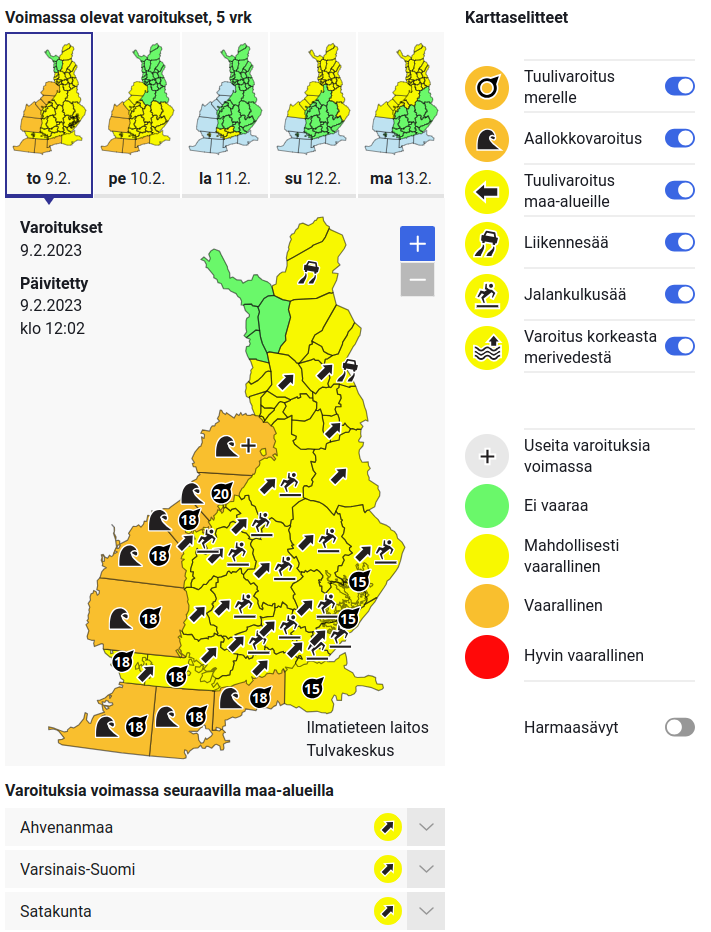

# SmartMet Alert Client (smartmet-alert-client)

SmartMet Alert Client is a customizable map visualizer for weather, flood and other alerts.



## Project setup
```
npm install
```

### Compiles and hot-reloads for development
```
npm run serve
```

### Compiles and minifies for production
```
npm run build
```

### Lints and fixes files
```
npm run lint
```

### Localization

The default language is defined in the .env file. This can be overridden when defining a Vue component:
```
<template>
    <AlertClient :refreshInterval="refreshInterval" :selectedDay="selectedDay" language="en"/>
</template>
```